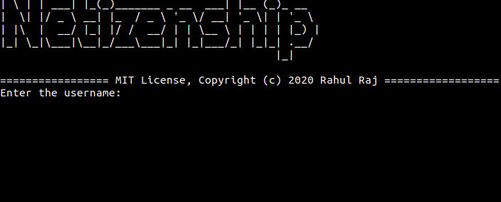

# Netizenship 

This is a commandline tool to find the online presence of a username in popular social media websites like Facebook, Instagram, Twitter, etc.

## Installation

Install this tool via following command

~~~
sudo pip3 install netizenship
~~~

## Usage

Once the tool is installed, run it by executing the command 

~~~
netizenship
~~~

and then enter the username to search for

## Contribute

This tool is presently at infant stage. I highly appreciate improvements and suggestions.

## License

MIT License 

Copyright (c) 2020 Rahul Raj

Read full license [here](./LICENSE)
